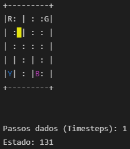
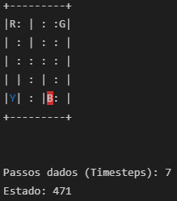
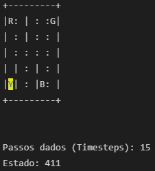
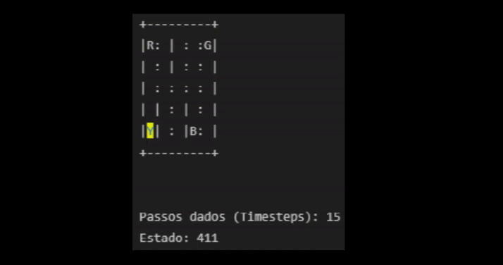

# Trajeto Táxi

**Número da Lista**: X<br>
**Conteúdo da Disciplina**: Grafos1<br>

## Alunos
|Matrícula | Aluno |
| -- | -- |
| 18/0096991  |  Álvaro Leles Guimaraes |
| 18/0102087  |  Ian Fillipe Pontes Ferreira |

## Sobre 
Imagine a seguinte situação: uma empresa de táxi gostaria de saber qual o caminho mais curto para deslocar o táxi até um passageiro que o requisitou, e depois o caminho mais curto até seu destino.
Para isso, esse projeto tem como objetivo criar e mostrar como é possível, mapeando pontos pela cidade, encontrar o caminho mais curto entre esses pontos.
No nosso projeto, o táxi é representado pelo retângulo amarelo, o passageiro está na letra de cor rosa e seu destino está na letra de cor azul.

## Screenshots
Posição inicial do táxi | Táxi pegando o passageiro | Táxi deixando o passageiro
:---------: | :------: | :-------:
 |  | 
|  |  |

## Instalação 
**Linguagem**: Python<br>
**Pré-requisitos**: Para rodar o projeto é necessário ter o Python instalado na versão 3.6.8, que foi a versão utilizada, ou uma versão superior.

- Etapas para rodar o projeto:

### **0. Executar o código pelo Google Colab:**

Caso prefira, você pode optar por executar a aplicação pelo Google Colab, o que evita que todos as etapas seguintes precisem ser feitas.

Acesse o projeto no Google Colab [aqui](https://colab.research.google.com/drive/1HrVbskwKHPJf0IRoSMOzGnSZdn_Y4Ee-?usp=sharing).

Para rodar as células no Google Colab, basta clicar no ícone de 'play', que se encontra no lado esquerdo de cada célula.

### **1. Clonar o repositório:**

```python
git clone https://github.com/projeto-de-algoritmos/Grafos1_TaxiTrajeto.git
```

**Para realizar os próximos passos, acesse pelo terminal a pasta do projeto.**

### **2. Instalar o ambiente virtual:**

Aconselhamos realizar o processo de instalação das dependências utilizando um ambiente virtual, e recomendamos para isso a **virtualenv**. 

Caso prefira, utilize outro ambiente virtual de sua escolha, ou faça a instalação das dependências diretamente na sua máquina, em qualquer um dos casos, pule para a etapa 3.

- Instalar a virtualenv
```python
pip install virtualenv
```

- Criar o ambiente virtual
```python
virtualenv Grafos1_TaxiTrajeto
```

- Acessar o ambiente virtual
```python
Grafos1_TaxiTrajeto/Scripts/Activate
```

### **3. Instalar as dependências necessárias:** 

- No terminal, na pasta raiz do projeto, execute: 
```python
pip install -r requirements.txt
```

<!-- Descreva os pré-requisitos para rodar o seu projeto e os comandos necessários. -->

## Uso 

Para usar a aplicação, recomendamos a utilização do [Visual Studio Code](https://code.visualstudio.com/download) (nome com o link para o download).

Após abrir o projeto no Visual Studio Code, abra o arquivo taxi.ipynb, que é um notebook Python.

**Execução da aplicação**

1. **Rodar cada uma das células do notebook:** Para isso, basta clicar no ícone  no lado esquerdo de cada célula

2. **Rodar todas as células do notebook de uma vez:** Para isso, basta clicar no 'Executar tudo' na aba que se encontra no início do notebook.


Para conseguir rodar a aplicação é necessário selecionar o Kernel que servirá de base para rodar a projeto, e essa seleção é solicitada ao rodar pela primeira vez uma célula ou ao tentar rodar todo o notebook, e a terceira opção é selecionando o kernel no botão 'Selecione Kernel' na aba que se encontra no início do notebook. Sendo que o Kernel que será utilizado, será a versão do Python local da sua máquina ou o ambiente virtual, ou seja, onde está instalado as dependências do projeto.

## Outros

<div align="center">


[Figura 1: Representação do mapa](./imagens/taxienv.png)

</div>

No mapa, o passageiro sempre será representado pelo cor rosa, e o destino pela cor azul. Sendo que, tanto o passageiro quanto o destino, podem estar em 4 possíveis localizações.

- Possíveis localizações do passageiro e do destino:

|Index|Letra
|:---:|:---:|
|  0 | R  |   
| 1  | G  |   
| 2  | Y  |  
| 3  | B  |  

